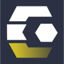
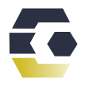
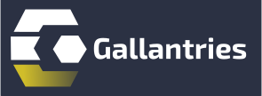
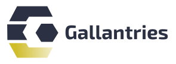

# Logos

Use on dark background | Use on light background
--- | ---
 | 
[SVG Logo](assets/images/gallantries-logo.svg) | [SVG Logo](assets/images/gallantries-logo-inverted.svg)
 | 
[SVG Logo](assets/images/gallantries-logo-with-word.svg) | [SVG Logo](assets/images/gallantries-logo-with-word-inverted.svg)
 | 
[SVG Logo](assets/images/gallantries-logo-with-word-large.svg) | [SVG Logo](assets/images/gallantries-logo-with-word-inverted-large.svg)

# Current Blurb

The Gallantries project is a collaboration between five European universities, members of Software Carpentry, and members of the Galaxy Project. The project aims to increase bioinformatics and core data analysis skills in the field of life sciences across Europe. In collaboration with higher education institutions we will be developing novel bioinformatics learning modules which can be used alone or combined together to easily build courses with reusable, regularly updated lessons. Several institutions are exploring giving ECTS for completion of these modules.

A pilot effort in 2019 developed Hybrid Training; students in classrooms watched a single instructor broadcast a lesson and on-site helpers assisted them. This significantly improved the scalability and decreased the environmental impact of having the best instructors travel around Europe to teach. With the SARS-CoV-2 pandemic in 2020 we have moved to fully online lessons further decreasing environmental impact of teaching and bringing the best instructors to students, while simultaneously making lessons more accessible for all learners.

# Carpentries Blurb

The Carpentries initiative aims at teaching basic computational competencies (coding, data management) to scientists through the use of live-coding and adherence to a set of best-practice pedagogical guidelines.

# Galaxy Blurb 1

The [Galaxy data analysis platform](https://galaxyproject.org) is a free, online, user-friendly data analysis platform, that makes complex data analyses—otherwise only accessible to trained bioinformaticians—accessible to all scientists.

# Galaxy Blurb 2

Galaxy is an open, web-based platform for accessible, reproducible, and transparent computational research. *Accessible*: programming experience is not required to easily upload data, run complex tools and workflows, and visualize results. *Reproducible*: Galaxy captures information so that you don't have to; any user can repeat and understand a complete computational analysis, from tool parameters to the dependency tree. *Transparent*: Users share and publish their histories, workflows, and visualisations via the web. *Community centered*: Our inclusive and diverse users (developers, educators, researchers, clinicians, etc.) are empowered to share their findings.

# GTN Blurb

In collaboration with [GOBLET](https://www.mygoblet.org/) and the [ELIXIR Training Platform](https://www.elixir-europe.org/platforms/training), the [Galaxy Training Network (GTN)](https://galaxyproject.org/teach/gtn/) developed an infrastructure to deliver open, peer-reviewed and FAIR training material with [>190 tutorials developed by >170 contributors,](https://training.galaxyproject.org/stats) available at [training.galaxyproject.org](https://training.galaxyproject.org), for scientists, developers, and system administrators.

# Pre-grant blurbs

Last year we piloted a novel paradigm for distributed training, where some of the most experienced Galaxy trainers in High Throughput Sequencing data analysis were able to provide training on that topic, which was simultaneously broadcasted across Europe. Interested groups simply announced a workshop, ordered some coffee and booked a computer room, and then joined the live stream, while having the opportunity to directly interact with the trainer for questions, clarifications and general feedback. The overall training, webserver administration, compute resources, training material and all other aspects of the event was handled by our team for all involved sites.

This new way of doing training allowed us to scale training dramatically; instead of having those few experienced people teach 20 students at a time, we enabled them to teach 100 across multiple sites! And without the cost of lodging, travel, or the CO2 emitted during travel.

This year we’re applying for an ERASMUS+ grant which will enable us to scale this idea further; in addition to the current tutorials, we’re adding three new tracks to the distributed training: Ecology, Metagenomics, and Genome Annotation.

If this is interesting to you (i.e. being involved in the general discussion, plus being one of the distributed sites that will receive these remote trainings), we’re looking for a letter of support that we can use in our grant application in order to help us demonstrate the existing interest.
